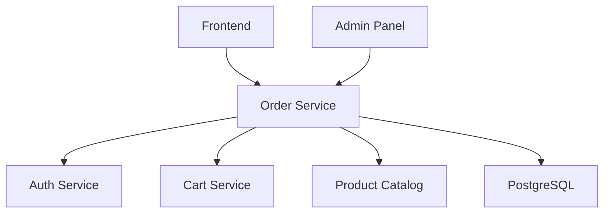

# Order Processing Service

Order lifecycle management service for Project Zero App e-commerce platform. Handles the complete order workflow from cart checkout to delivery, with integration to cart, auth, and product catalog services.

## Features

- **Order Creation**: Convert cart items to orders with tax and shipping calculations
- **Order Management**: Complete CRUD operations for orders with status-based workflows
- **Admin Interface**: Admin endpoints for order management across all users
- **Shipping Calculation**: Weight-based shipping cost calculation with multiple tiers
- **Status Tracking**: Complete order lifecycle management with audit trails
- **Service Integration**: Seamless integration with auth, cart, and product catalog services

## Quick Start

### Prerequisites

- Python 3.13+
- `uv` package manager
- PostgreSQL (production) or SQLite (development)

### Development Setup

1. **Clone and navigate**:
   ```bash
   cd services/order-service
   ```

2. **Install dependencies**:
   ```bash
   uv sync
   ```

3. **Configure environment**:
   ```bash
   cp .env.example .env
   # Edit .env with your configuration
   ```

4. **Run the service**:
   ```bash
   uv run uvicorn main:app --host 0.0.0.0 --port 8008 --reload
   ```

5. **Access the API**:
   - API Documentation: http://localhost:8008/docs
   - Health Check: http://localhost:8008/health

### Environment Configuration

| Variable | Description | Default | Required |
|----------|-------------|---------|-----------|
| `DATABASE_URL` | Database connection string | `sqlite:///./order_service.db` | No |
| `JWT_SECRET_KEY` | JWT signing key (must match auth service) | Auto-generated | Recommended |
| `AUTH_SERVICE_URL` | Auth service URL | `http://localhost:8001` | Yes |
| `CART_SERVICE_URL` | Cart service URL | `http://localhost:8007` | Yes |
| `PRODUCT_SERVICE_URL` | Product catalog URL | `http://localhost:8004` | Yes |
| `TAX_RATE` | Fixed tax rate | `0.085` (8.5%) | No |
| `HOST` | Server host | `0.0.0.0` | No |
| `PORT` | Server port | `8008` | No |

## API Endpoints

### Order Management

- `POST /orders` - Create order from cart
- `GET /orders` - Get user order history
- `GET /orders/{id}` - Get order details
- `PATCH /orders/{id}` - Modify order (status-dependent)
- `POST /orders/{id}/cancel` - Cancel order
- `PUT /orders/{id}/status` - Update order status (admin)
- `GET /orders/{id}/status-history` - Get status history

### Admin Management

- `GET /admin/orders` - Get all orders (admin only)
- `PUT /admin/orders/{id}/status` - Admin status updates

### Shipping

- `POST /shipping/calculate` - Calculate shipping cost
- `GET /shipping/rates` - Get available shipping rates

### Health

- `GET /health` - Basic health check
- `GET /health/ready` - Readiness check with dependencies

## Business Logic

### Order Status Workflow

```
PENDING → CONFIRMED → PROCESSING → SHIPPED → DELIVERED
    ↓         ↓           ↓
 CANCELLED  CANCELLED  CANCELLED
```

### Tax Calculation

- Fixed rate: 8.5% (configurable)
- Applied to order subtotal
- Calculated at order creation time

### Shipping Calculation

Weight-based tiers:
- Light (≤1 lb): $5.99
- Medium (≤5 lb): $8.99
- Heavy (≤20 lb): $15.99
- Freight (>20 lb): $25.99

Zone multipliers:
- Local: 1.0x
- Regional: 1.2x
- National: 1.5x
- Expedited: 2.0x

## Service Integration

### Authentication Flow
1. All endpoints require JWT token from auth service
2. Admin endpoints require admin role
3. User-specific endpoints enforce ownership

### Order Creation Flow
1. Validate JWT token with auth service
2. Retrieve cart contents from cart service
3. Validate product availability with catalog service
4. Calculate taxes and shipping
5. Create order and clear cart
6. Return order confirmation

## Development

### Running Tests

```bash
# Run all tests
uv run pytest

# Run specific test categories
uv run pytest tests/contract/        # API contract tests
uv run pytest tests/integration/    # Integration tests
uv run pytest tests/unit/          # Unit tests

# Run with coverage
uv run pytest --cov=src --cov-report=term-missing
```

### Code Quality

```bash
# Format code
uv run ruff format .

# Lint code
uv run ruff check .

# Type checking (if mypy configured)
uv run mypy src/
```

### Database Migrations

```bash
# Create new migration
uv run alembic revision --autogenerate -m "Description"

# Apply migrations
uv run alembic upgrade head

# Migration status
uv run alembic current
uv run alembic history
```

## Docker Deployment

### Build and Run

```bash
# Build image
docker build -t order-service:latest .

# Run with Docker Compose
docker-compose up -d

# Check health
curl http://localhost:8008/health
```

### Production Configuration

1. Use PostgreSQL database
2. Set strong JWT secret key
3. Configure service URLs for container networking
4. Enable health checks and monitoring
5. Set appropriate resource limits

## Monitoring & Observability

### Health Checks

- `/health` - Basic service health
- `/health/ready` - Service + dependencies readiness

### Logging

- Structured JSON logging
- Correlation ID tracking
- Request/response logging
- Service integration logging

### Metrics

Service exposes standard metrics:
- Request counts and latencies
- Database connection status
- External service health
- Order processing metrics

## Security

- JWT token validation for all endpoints
- Role-based access control (user/admin)
- Input validation with Pydantic
- SQL injection prevention via ORM
- CORS configuration
- Non-root container execution

## Performance

### Optimization Features

- Database connection pooling
- Efficient queries with proper indexing
- Async HTTP clients for external services
- Request/response caching where appropriate

### Scale Considerations

- Stateless service design
- Database read replicas support
- External service circuit breakers
- Horizontal scaling ready

## Troubleshooting

### Common Issues

**Service won't start:**
- Check database connectivity
- Verify environment configuration
- Ensure dependencies are installed

**Orders not creating:**
- Verify auth service connectivity
- Check cart service integration
- Validate product catalog availability

**Status updates failing:**
- Ensure user has admin privileges
- Check order status transition rules
- Verify database connectivity

### Debug Mode

```bash
# Run with debug logging
LOG_LEVEL=DEBUG uv run uvicorn main:app --reload --port 8008

# Check service logs
docker-compose logs order-service

# Database connection test
uv run python -c "from src.database import engine; print(engine.execute('SELECT 1').scalar())"
```

## Architecture

### Service Dependencies



### Data Flow

1. **User Authentication**: JWT validation via auth service
2. **Cart Retrieval**: Get cart contents from cart service
3. **Product Validation**: Verify products with catalog service
4. **Order Processing**: Calculate totals and create order
5. **Cart Cleanup**: Clear cart after successful order
6. **Status Management**: Track order through lifecycle

## Contributing

1. Follow existing code patterns and style
2. Write tests for new functionality
3. Update documentation for API changes
4. Ensure all tests pass before submitting
5. Follow semantic versioning for releases

## License

Part of Project Zero App - See main project license.